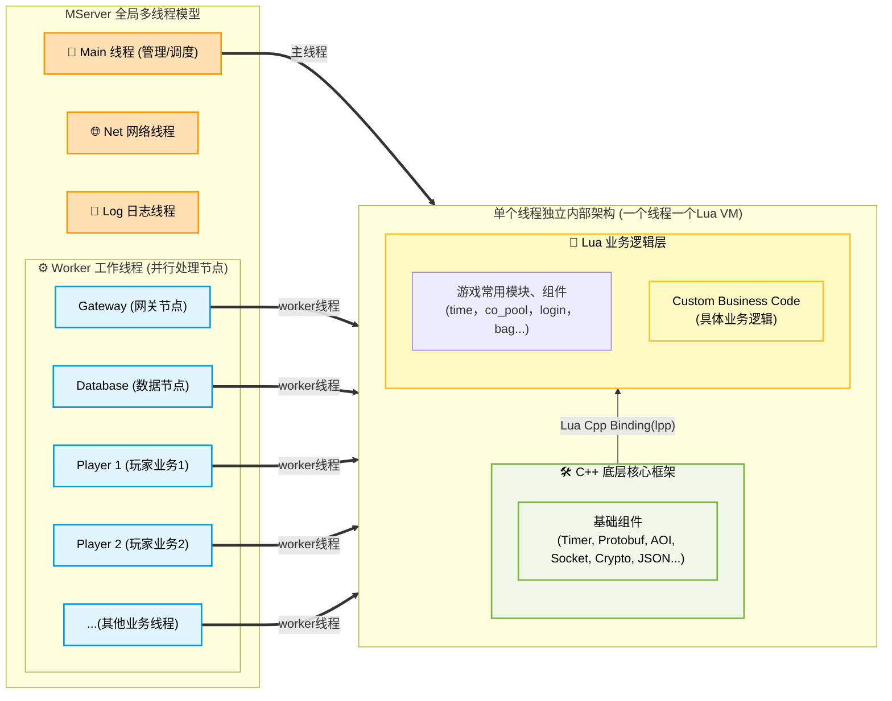

# MServer (Mini Distributed Game Server)

**MServer** 是一个轻量级、灵活可扩展、高效且易用的游戏服务器引擎。

- **高性能**：底层基于 C++ 实现，保证运行性能。提供完善的构建系统和`Lua Binding`，方便开发有性能要求的组件。
- **稳定性**：游戏业务逻辑采用 Lua 脚本进行开发，降低崩溃宕机的概率，保持极高的开发效率高。
- **扩展性**：可以在多线程、多进程、集群模式中切换，根据需求扩展线程节点数量。

## 核心功能
- Lua热更新
- Lua面向对象编程（可选）
- 网络：Tcp、Http、Websocket，支持SSL
- RPC（支持协程、异步回调）
- Protobuf
- 数据库：MySQL/MariaDB、MongoDB
- JSON、XML、AOI、AStar、关键字过滤等游戏开发常用组件

## 进程架构

MServer 在设计上采用了**多进程多线程**的架构，由业务需求灵活配置进程与线程的数量，单个进程主要包含以下几个核心部分：
1. **一个网络线程 (Network Thread)**：负责底层网络数据的收发与解析。
2. **一个日志线程 (Log Thread)**：负责异步处理日志。
3. **一个主线程 (Main Thread)**：作为管理者，负责管理以及协调其它工作线程。
4. **N 个工作线程 (Worker Threads)**：根据业务可开启0个或者N个线程，每个 Worker 线程都拥有一个**独立隔离的 Lua 虚拟机**执行业务逻辑。

## 其他

* 配置导表工具：https://github.com/changnet/py_exceltools
