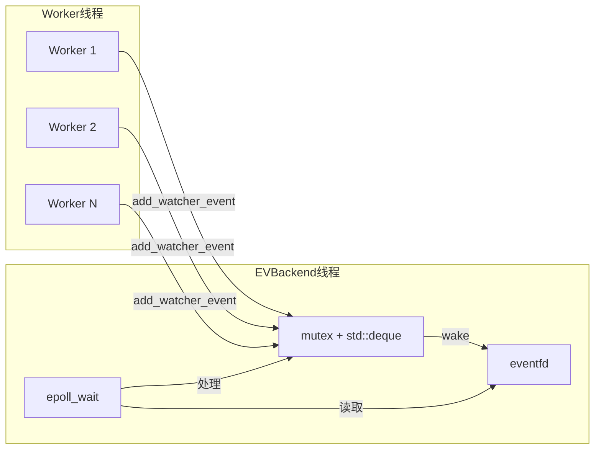
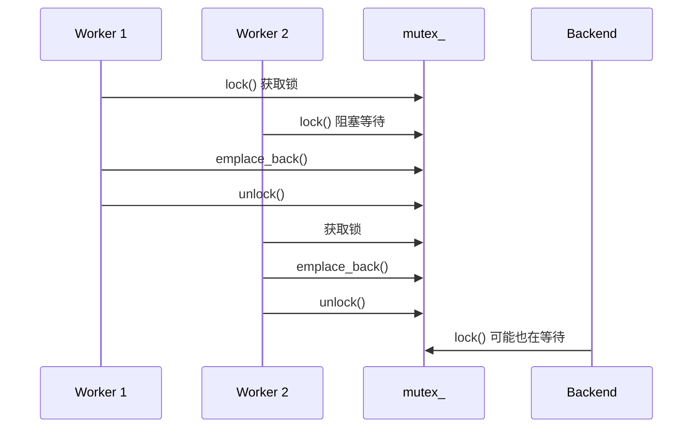
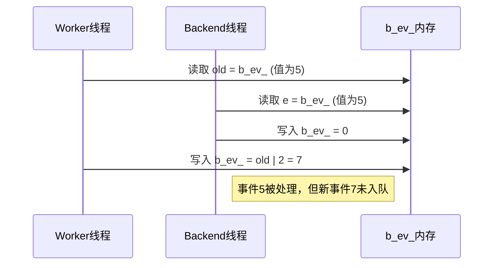
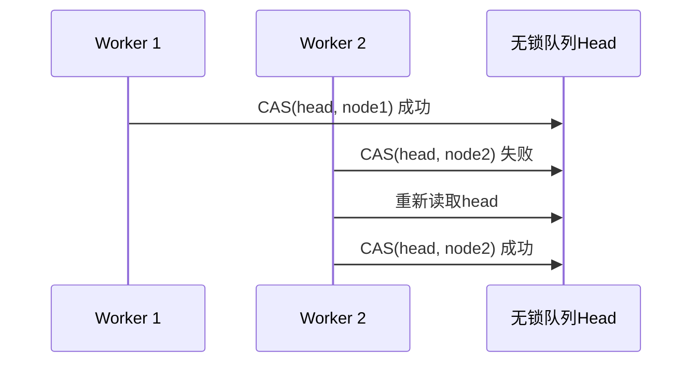

# 问题
分析当前网络读写线程方案的问题，给出可能的优化方案，同时对比各种方案的优缺点，列出每个方案各个步骤的性能消耗。本次仅分析方案是否可行，不修改任何代码

* 仔细阅读ev_backend.cpp。这是一个多纯种游戏框架的事件循环（epoll或者WSAPoll等），专门用于处理网络读写。有多个逻辑线程会往ev_backend线程发送数据。

* 当逻辑线程要发送数据时，调用EVBackend::add_watcher_event()函数，并唤醒ev_backend线程

* ev_backend线程被唤醒后，通过do_wait_event()处理来自网络的事件，同时do_watcher_events()处理来自逻辑线程的事件

* 为了优化游戏频繁发送数据的操作，通过mutex加锁来避免同一个事件提交多次。这就导致了极多的加锁操作，对系统性能有影响

* 现在有几种方案(方案1为当前使用的方案)
    1. std::mutex加锁，把数据放入std::dequeue，写入1字节到event_fd唤醒ev_backend，ev_backend加锁从std::dequeue取出数据
        加锁比较耗时，可能会出现竞争，同时写入event_fd也是一次系统调用，内部用spin_lock
    2. 数据直接写入pipe，通过pipe唤醒ev_backend，ev_backend通过pipe读取出数据
        单次数据可以保证小于PIPE_BUF，具备原子性
        写入pipe是一次系统调用
        pipe在内核也是加锁实现，也会出现竞争，同时需要在用户空间和内核空间复制数据
        没有了锁，watcher的b_ev_字段，要么改为atomic，要么把事件一同写入pipe，消耗又大了些
        pipe无法像其他方案一样，根据队列是否为空判断是否需要唤醒，只能每次都唤醒
    3. 把数据放入无锁队列，写入1字节到event_fd唤醒ev_backend，ev_backend从无锁队列取出数据
        无锁队列本身也是用atomic操作的，这个消耗比mutex没小多少
        写入event_fd也是一次系统调用，内部用spin_lock
        没有了锁，watcher的b_ev_字段，要么改为atomic，要么把事件一同放入无锁队列，消耗又大了些

# 网络线程方案分析

本文档分析当前 `ev_backend.cpp` 中网络读写线程方案的问题，对比三种不同方案的优缺点，并列出每个步骤的性能消耗。

---

## 当前架构概述



### 关键代码路径

1. **逻辑线程发送数据**: 调用 [add_watcher_event](file:///d:/dev/MServer/engine/src/ev/ev_backend.cpp#L496-L511)
2. **EVBackend被唤醒**: 通过 `eventfd` 唤醒，调用 [do_watcher_events](file:///d:/dev/MServer/engine/src/ev/ev_backend.cpp#L428-L464)
3. **防止重复入队**: 使用 `b_ev_` 字段判断是否已在队列中

---

## 方案对比分析

### 方案1: std::mutex + std::deque + eventfd（当前方案）

#### 生产端实现
```cpp
void EVBackend::add_watcher_event(EVIO *w, int32_t ev)
{
    {
        std::scoped_lock<std::mutex> sl(mutex_);  // 1. 加锁
        int32_t old = w->b_ev_;
        w->b_ev_ = old | ev;                       // 2. 合并事件
        if (0 != old || ...) return;               // 3. 避免重复入队
        watcher_events_.emplace_back(w);           // 4. 入队
        if (watcher_events_.size() > 1) return;    // 5. 判断是否需要唤醒
    }
    wake();  // 6. 写入eventfd唤醒
}
```

#### 消费端实现（关键瓶颈）
```cpp
void EVBackend::do_watcher_events()
{
    for (int32_t i = 1; i < 1024; i++)
    {
        EVIO *w;
        int32_t e;
        {
            std::scoped_lock<std::mutex> sl(mutex_);  // 每次循环都加锁！
            if (watcher_events_.empty()) { busy_ = false; return; }
            w = watcher_events_.front();
            watcher_events_.pop_front();
            e = w->b_ev_;   // 必须在锁内读取
            w->b_ev_ = 0;   // 必须在锁内清零
        }
        // 处理事件...
    }
}
```

> [!WARNING]
> **核心问题**：由于 `b_ev_` 是非 atomic 变量，消费端必须在持锁时读取和清零 `b_ev_`。
> 这导致**每处理一个事件就要加锁/解锁一次**，无法批量处理。

#### 性能消耗分析

**生产端（Worker线程）**：

| 步骤 | 操作 | 耗时估计 | 说明 |
|:---:|:---|:---:|:---|
| 1 | `std::mutex` 加锁 | 20-100ns | 无竞争时较快，有竞争时升级为内核态 |
| 2 | `b_ev_ \|= ev` | ~1ns | 简单位操作 |
| 3 | 条件判断 | ~1ns | 分支预测友好 |
| 4 | `deque::emplace_back` | 10-50ns | 可能触发内存分配 |
| 5 | `size()` 判断 | ~1ns | O(1) 操作 |
| 6 | `write(eventfd)` | 200-500ns | 系统调用，内核使用 spin_lock |

**消费端（Backend线程，假设队列有N个事件）**：

| 步骤 | 操作 | 耗时估计 | 说明 |
|:---:|:---|:---:|:---|
| 1 | `std::mutex` 加锁 × N | 20-100ns × N | **每个事件都要加锁** |
| 2 | `front() + pop_front()` | 5-20ns × N | deque操作 |
| 3 | 读取并清零 `b_ev_` | ~2ns × N | 必须在锁内 |
| 4 | 解锁 | ~10ns × N | |
| 5 | 处理事件 `do_watcher_event()` | 100-500ns × N | 实际业务逻辑 |

**批量处理对比**：

| 场景 | 当前方案（N次加锁） | 优化方案（1次加锁+swap） |
|:---|:---:|:---:|
| 10个事件 | 300-1100ns 锁开销 | 30-110ns 锁开销 |
| 100个事件 | 3-11μs 锁开销 | 30-110ns 锁开销 |
| 1000个事件 | 30-110μs 锁开销 | 30-110ns 锁开销 |

#### 如果 b_ev_ 改为 atomic

```cpp
void EVBackend::do_watcher_events()
{
    std::deque<EVIO*> local_queue;
    {
        std::scoped_lock<std::mutex> sl(mutex_);
        local_queue.swap(watcher_events_);  // 只加锁一次，O(1) swap
        busy_ = !local_queue.empty();
    }
    for (auto w : local_queue)
    {
        int32_t e = w->b_ev_.exchange(0, std::memory_order_acq_rel);  // 无需锁
        // 处理事件...
    }
}
```

这样消费端只需**一次加锁**，大幅减少锁竞争。

#### 优点
- ✅ 实现简单，逻辑清晰
- ✅ 可以通过 `b_ev_` 合并多次事件，减少队列长度
- ✅ 可以通过 `size() > 1` 判断避免重复唤醒

#### 缺点
- ❌ **消费端每个事件都加锁**：N个事件需要N次加锁/解锁
- ❌ 高并发下 mutex 竞争严重，Worker与Backend争抢同一把锁
- ❌ eventfd 是系统调用，有内核态切换开销
- ❌ 无法使用 swap 优化，因为 `b_ev_` 必须在锁内访问

#### 锁竞争场景分析



---

### 方案2: pipe 直接传递数据

#### 实现原理
```cpp
void EVBackend::add_watcher_event(EVIO *w, int32_t ev)
{
    struct Event { EVIO *w; int32_t ev; };
    Event e = {w, ev};
    ::write(pipe_fd_[1], &e, sizeof(e));  // 原子写入
}
```

#### 性能消耗分析

| 步骤 | 操作 | 耗时估计 | 说明 |
|:---:|:---|:---:|:---|
| 1 | 构造Event结构 | ~1ns | 栈上分配 |
| 2 | `write(pipe)` | 300-800ns | 系统调用，内核加锁，用户/内核数据拷贝 |

#### 优点
- ✅ 无需用户态锁，代码简单
- ✅ 小于 `PIPE_BUF`（Linux为4096）的写入具备原子性
- ✅ `write` 和 `read` 天然保证顺序

#### 缺点
- ❌ **每次都必须唤醒**：无法像方案1/3那样通过判断队列是否为空来避免重复唤醒
- ❌ 内核态锁竞争：pipe 在内核中使用 `pipe_lock`，多线程写入仍有竞争
- ❌ 数据拷贝开销：用户空间 → 内核空间 → 用户空间
- ❌ **`b_ev_` 字段问题**：没有mutex保护，需要改为 `atomic` 或把事件写入pipe
- ❌ 无法合并事件：同一个watcher多次发送会产生多个pipe消息

#### b_ev_ 字段问题详解

当前方案中 `b_ev_` 的使用：
```cpp
// 写入端(Worker线程): ev_backend.cpp:501-502
int32_t old = w->b_ev_;
w->b_ev_ = old | ev;

// 读取端(Backend线程): ev_backend.cpp:447-448
e = w->b_ev_;
w->b_ev_ = 0;
```

如果使用 pipe 方案，没有 mutex 保护，会出现数据竞争：



解决方案：
1. **`b_ev_` 改为 `atomic<int32_t>`**：使用 CAS 操作，增加约10-30ns开销
2. **把事件一同写入pipe**：每次写入 `sizeof(EVIO*) + sizeof(int32_t)` = 12字节

---

### 方案3: 无锁队列 + eventfd

#### 实现原理
```cpp
// 使用 MPSC (Multiple Producer Single Consumer) 无锁队列
void EVBackend::add_watcher_event(EVIO *w, int32_t ev)
{
    // 需要atomic操作来合并事件
    int32_t old = w->b_ev_.fetch_or(ev, std::memory_order_acq_rel);
    if (0 != old) return;

    lock_free_queue_.push(w);  // 无锁入队

    if (queue_was_empty) {
        wake();  // 写入eventfd
    }
}
```

#### 性能消耗分析

| 步骤 | 操作 | 耗时估计 | 说明 |
|:---:|:---|:---:|:---|
| 1 | `atomic::fetch_or` | 10-30ns | CAS操作，cache line竞争时会更慢 |
| 2 | 条件判断 | ~1ns | 分支预测 |
| 3 | 无锁队列 push | 20-80ns | CAS循环，竞争时可能多次重试 |
| 4 | 判断是否需要唤醒 | 10-30ns | atomic读取队列状态 |
| 5 | `write(eventfd)` | 200-500ns | 系统调用 |

#### 优点
- ✅ 避免了 mutex 阻塞，Worker线程不会因锁而休眠
- ✅ 可以保留事件合并逻辑
- ✅ 可以判断队列是否为空来避免重复唤醒

#### 缺点
- ❌ **无锁队列本身使用 atomic**：CAS 操作开销并不比轻量级锁小多少
- ❌ **`b_ev_` 必须改为 `atomic`**：增加额外开销
- ❌ 高竞争下 CAS 重试增多：性能可能反而不如 mutex
- ❌ 实现复杂度高：需要处理 ABA 问题，或使用成熟的无锁队列库
- ❌ 仍需 eventfd 系统调用

#### 无锁队列竞争分析



在高并发场景下，CAS 重试次数增加，性能下降。

---

## 性能对比总结

### 生产端单次操作耗时（无竞争）

| 方案 | 用户态操作 | 系统调用 | 总耗时估计 |
|:---|:---:|:---:|:---:|
| 方案1: mutex+deque+eventfd | 30-150ns | 200-500ns | 230-650ns |
| 方案1优化: atomic b_ev_ | 40-160ns | 200-500ns | 240-660ns |
| 方案2: pipe | ~1ns | 300-800ns | 300-800ns |
| 方案3: 无锁队列+eventfd | 40-140ns | 200-500ns | 240-640ns |

### 消费端开销对比（N个事件）

| 方案 | 锁开销 | 额外开销 | 批量处理N=100 |
|:---|:---:|:---:|:---:|
| 方案1（当前） | N次加锁/解锁 | - | 3-11μs 锁开销 |
| 方案1优化（atomic+swap） | 1次加锁 | N次atomic exchange | 30ns + 1-3μs atomic |
| 方案2（pipe） | 无 | N次read系统调用 | 30-80μs 系统调用 |
| 方案3（无锁队列） | 无 | N次atomic exchange | 1-3μs atomic |

> [!IMPORTANT]
> **消费端是当前方案的关键瓶颈**。方案1优化后的swap策略可使锁开销从O(N)降到O(1)。

### 高竞争场景（多Worker同时发送）

| 方案 | 竞争行为 | 最坏情况 |
|:---|:---|:---|
| 方案1 | mutex 可能升级为 futex，线程休眠 | 微秒级延迟 |
| 方案1优化 | 锁竞争减少，Backend持锁时间短 | 竞争显著降低 |
| 方案2 | 内核 pipe_lock 竞争 | 内核态自旋 |
| 方案3 | CAS 循环重试 | 多次重试消耗 CPU |

---

## 优化方向建议

### 方案1的最小改动优化

将 `b_ev_` 改为 `atomic<int32_t>`，消费端采用swap策略：

```cpp
// ev_watcher.hpp
std::atomic<int32_t> b_ev_;  // 改为 atomic

// ev_backend.cpp - 生产端
void EVBackend::add_watcher_event(EVIO *w, int32_t ev)
{
    int32_t old = w->b_ev_.fetch_or(ev, std::memory_order_acq_rel);  // atomic
    if (0 != old) return;  // 已有事件，无需入队

    {
        std::scoped_lock<std::mutex> sl(mutex_);
        if (0 == (w->mask_ & EVIO::M_REF_BACKEND)) return;
        watcher_events_.emplace_back(w);
        if (watcher_events_.size() > 1) return;
    }
    wake();
}

// ev_backend.cpp - 消费端
void EVBackend::do_watcher_events()
{
    std::deque<EVIO*> local_queue;
    {
        std::scoped_lock<std::mutex> sl(mutex_);
        local_queue.swap(watcher_events_);  // O(1) swap，只加锁一次
        busy_ = !local_queue.empty();
    }
    for (auto w : local_queue)
    {
        int32_t e = w->b_ev_.exchange(0, std::memory_order_acq_rel);
        // 处理事件...
    }
}
```

**收益**：
- 消费端锁开销从 O(N) 降到 O(1)
- Backend持锁时间极短，减少与Worker的竞争

**代价**：
- `b_ev_` 改为 atomic，每次操作增加 ~10-30ns
- 需要修改 `add_watcher_event` 和 `set_watcher_event`

### 其他可能的改进思路

1. **分片锁 (Sharded Locks)**
   - 按 Worker ID 或 watcher ID 分片，减少锁竞争
   - 每个分片一个队列，Backend 轮询多个队列

2. **批量提交**
   - Worker 线程本地缓冲多个事件，定期批量提交
   - 减少加锁次数和 eventfd 唤醒次数

3. **Thread-Local Queue + 周期性合并**
   - 每个 Worker 有独立的队列
   - Backend 周期性扫描所有 Worker 队列

4. **io_uring (Linux 5.1+)**
   - 使用环形缓冲区，减少系统调用
   - 需要内核版本支持

---

## 结论

| 方案 | 推荐程度 | 理由 |
|:---|:---:|:---|
| 方案1优化（atomic+swap） | ⭐⭐⭐⭐ | 最小改动，消费端锁开销O(1)，收益明显 |
| 方案1（当前） | ⭐⭐⭐ | 实现简单，但消费端锁开销O(N)是瓶颈 |
| 方案2（pipe） | ⭐⭐ | 无法合并事件，每次都唤醒，消费端read开销大 |
| 方案3（无锁） | ⭐⭐ | 复杂度高，收益不如方案1优化明显 |

> [!NOTE]
> 本次分析仅评估方案可行性，未做实际性能测试。
> 建议优先考虑"方案1优化"，即将 `b_ev_` 改为 atomic 并采用 swap 策略。


## 补充
方案1（加锁 + int）和方案1优化(加锁 + atomic + swap)方案对比，假如加锁20ns（无竞争状态，加锁解锁两次操作），atomic操作10ns
1. 100个watcher，100个事件
```
（加锁 + int）：写（100x20） + 读（100x20） = 4000
（加锁 + atomic + swap）：写（100x20 + 10x100） + 读（20 + 100x10） = 4020
```
2. 5个watcher，100个事件
```
（加锁 + int）：写（100x20） + 读（5x20） = 2100
（加锁 + atomic + swap）：写（5x20 + 10x100） + 读（20 + 5x10） = 1170
```

由于EVBackend线程会把事件取走，(加锁 + atomic + swap)方案在5个watcher时可能不会快那么多。但（加锁 + int）也是在无竞争状态下算得，
优化后atomic大幅减少mutex，能增加多线程的并发。

而且在游戏场景中，同一个socket一次性发送多个消息是很常见的场景
